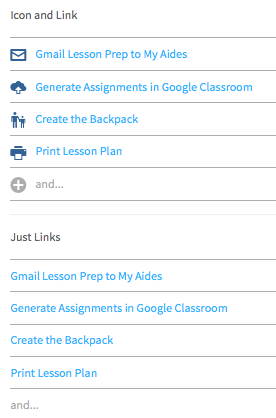

# Overview of RL Components
## rlSentence
This is a configurable component that allows you to pass in N parts of a sentence input/selection.
It can also act as a simple dropdown menu.


## rlCommon
This is a configurable navigation component.




This is a configurable loading component.


## rlSlider
The slider acts as a replacement for radio buttons when in single selection mode and as a mechanism to select a range of contiguous values when in range mode.


## rlTooltip
A tooltip with HTML content that can be launched and hidden by events.


The testbed is where each component can be launched on a test page. To make this reuseable, it is located in the clientComponents directory and the gulp tasks takes a component name as a parameter and builds the testbed for it.
For instance:
```
gulp -c rlChart serve
```	    
The serve tasks copies files to the testbed and launches the testbed.

build and other tasks on the component can also be invoked from the testbed, for instance
```
gulp -c rlChart build
```
We should attempt to integrate as many rlComponents as possible in order to achieve a consistent experience across their applications.

Here is a list of specific features where rlComponents are used, or could be used:

## Kanban
* "Add New Group" and other buttons and navigation elements should use rlCommon 
* We should try to use commong d&d functionality for both Kanban and working list. Current one from working list is not extentable.
* We should try to use commong Grouping/Accordion functionality for Kanban and wokring list. Current one in working list is not extentable.

## Search
* Filters currently support rlSlider
  Search results currently support rlReputation
* Sorting dropdown could use rlSentence
* Radio buttons could use rlCommon radio buttons
* We could show the rlCommon-loader while the search is loading
* Note: We are also using the [angular foundation](http://pineconellc.github.io/angular-foundation/) library for ..? 

## Working List
TBD

## Stack Control
* All dropdown menus in this control use the rlSentence component.

